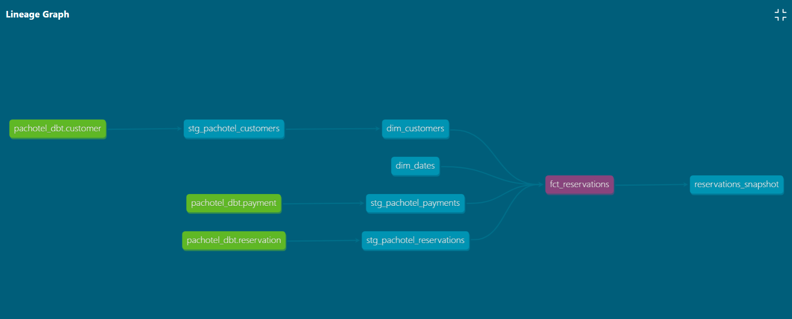

# **PacHotel dbt Repository**
---

- Merupakan repository untuk pembelajaran dbt Data Storage Pacmann Sekodeng case Pachotel
- Pada case ini menggunakan database Postgres
- Untuk menginstall dbt cukup memasukkan command `pip install dbt-postgres`
- Untuk data yang digunakan adalah [Pachotel](https://github.com/shandytepe/pachotel_data)
- Pastikan untuk config, sesuaikan dengan local masing - masing

### **How to Run dbt**
---

1. `dbt debug` untuk cek koneksi dengan database
2. `dbt deps` untuk menginstall package atau dependensi yang dibutuhkan
3. `dbt test` untuk melakukan test terhadap data model atau kolom yang diinginkan sekaligus membuat relasi database
4. `dbt run` untuk menjalankan data model yang sudah dibuat
5. `dbt docs generate` untuk generate dokumentasi dbt
6. `dbt docs serve` untuk deploy dokumentasi di website. Untuk mengakses dokumentasi ada di [http://localhost:8080](http://localhost:8080)

### **Data Lineage**
---

### **Tools**
---
1. Python
2. dbt
3. Postgres
4. DBeaver

Best Regards

Shandy